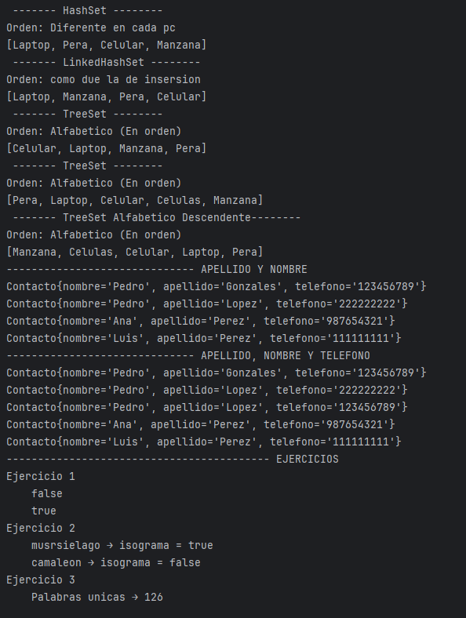

# Práctica de Búsqueda Binaria

## 📌 Información General

- **Título:** Práctica de controllers.Sets
- **Asignatura:** Estructura de Datos
- **Carrera:** Computación
- **Estudiante:** Brandon Fernando Rivera Zambrano
- **Fecha:** 01/07/2025
- **Profesor:** Ing. Pablo Torres

## 🚀 Ejecución

Para ejecutar el proyecto:

1. **Compila el código:**
   ```bash
   javac App.java


## 📌 Ejemplo de Salida



